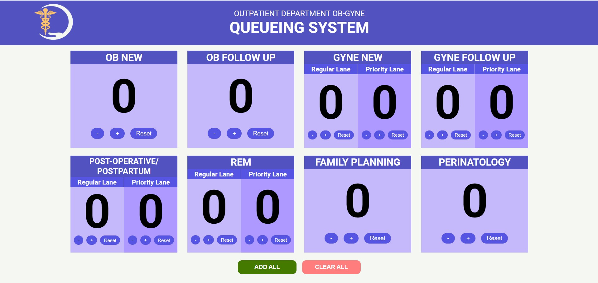

Enhanced Hospital Department Queue Display

**Overview
An enhanced queueing system display inspired by hospital OBGYNE department workflows.
This project provides a simple, real‑time interface for managing and visualizing patient queues, with support for multiple categories such as:
- OB‑New
- OB‑Follow‑Up
- Gyne‑New
- Gyne‑Follow‑Up
- Post‑Operative / Postpartum
- REM
- Family Planning
- Perinatology
Designed for clarity and efficiency in tracking when patients are called for doctor consultations.

**Features
- Real‑time queue updates
- Category‑based patient grouping
- Clear display for hospital waiting areas

**Demo Screenshot

